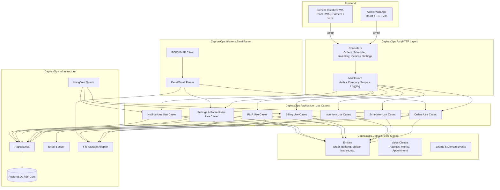
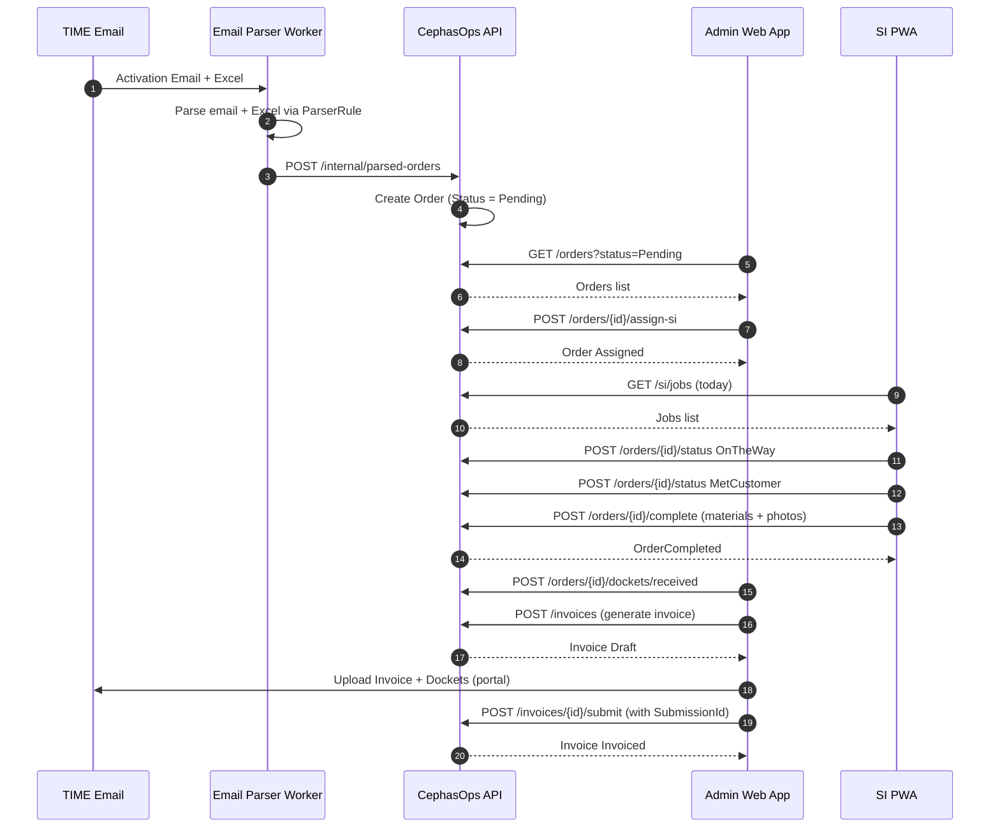

# SYSTEM_DESIGN_DIAGRAMS  
CephasOps – System Design Views (Phase 1: ISP Vertical)

This file captures **high-level** and **logical** diagrams of the CephasOps platform:

- How emails become orders
- How Admin / Scheduler / SI apps interact
- How backend services, DB, and storage fit together

---

## 1. High-Level ASCII Flow

End-to-end “business flow” from email → money:

```text
[Partner Email Inbox]
        |
        v
  [Email Parser Worker]
        |
        v
 [CephasOps API Backend]
        |
        +--> [Orders + Assurance]
        |        |
        |        +--> [Inventory & RMA]
        |        |
        |        +--> [Dockets & Docs Storage]
        |
        +--> [Scheduler Calendar]
        |        |
        |        +--> [Admin Web App]
        |        |
        |        +--> [Assign SI]
        |
        +--> [Service Installer PWA]
        |        |
        |        +--> [Order Status Updates]
        |        +--> [Photos + GPS + Materials Used]
        |
        +--> [Billing & Invoicing]
        |        |
        |        +--> [Portal Submission ID]
        |
        +--> [Finance & PNL Views]
                 |
                 +--> [Director Multi-Company Dashboards]
```

Simplified “operations-only” view:

```text
[Email] -> [Email Parser] -> [Orders] -> [Scheduler] -> [SI App]
[SI App] -> [Order Status + Materials] -> [Billing] -> [PNL]
```

---

## 2. Mermaid (Logical – Core Flow)

```mermaid
flowchart LR
  subgraph Partner Side
    E[Email Inbox (TIME)]
  end

  subgraph Workers
    P[Email Parser Worker<br/>POP3/IMAP + Excel Parser]
  end

  subgraph Backend["CephasOps Backend (API + App + Domain + Infra)"]
    O[Orders & Assurance Service]
    SCH[Scheduler Service]
    INV[Inventory & RMA Service]
    B[Billing & Invoicing Service]
    NTF[Notifications Service]
    CFG[Settings & Parser Rules]
  end

  subgraph Frontend["Frontends"]
    ADMIN[Admin / Ops Web App]
    SI[Service Installer PWA]
  end

  subgraph Data["Data Layer"]
    DB[(PostgreSQL<br/>EF Core)]
    FS[(File Storage<br/>Dockets, Photos, MRA PDFs)]
  end

  subgraph Jobs["Background Jobs"]
    J[Hangfire / Quartz<br/>KPI + PNL + Reminders]
  end

  %% Email ingestion
  E --> P
  P --> CFG
  P --> O

  %% Core backend flows
  ADMIN <-->|REST/JSON| O
  ADMIN <-->|REST/JSON| SCH
  ADMIN <-->|REST/JSON| INV
  ADMIN <-->|REST/JSON| B
  ADMIN <-->|REST/JSON| CFG

  SCH --> O
  O --> SCH

  SI <-->|REST/JSON| O
  SI --> INV

  %% Billing -> Finance
  O --> B
  B --> ADMIN
  B --> J

  %% Inventory and RMA
  O --> INV
  INV --> FS

  %% Notifications & Jobs
  O --> NTF
  B --> NTF
  NTF --> ADMIN
  NTF --> SI

  J --> O
  J --> B
  J --> INV

  %% Persistence
  O --> DB
  SCH --> DB
  INV --> DB
  B --> DB
  CFG --> DB
  NTF --> DB
  P --> FS
  O --> FS
```

---

## 3. Mermaid (Clean Architecture View)



---

## 4. Mermaid (Order Lifecycle Sequence – Optional)



---

This file is fully aligned with CephasOps architecture and Storybook.
